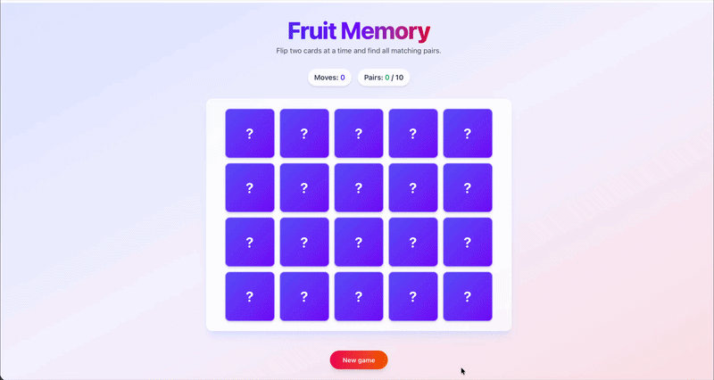

# 🎮 Fruit Memory Card Game

A fun and interactive memory card game built with React.js and TailwindCSS. Test your memory by matching pairs of fruit cards!


## 🖼️ Preview

<div align="center">
   
</div>

## 🎯 About

Fruit Memory is a classic memory matching game where players flip cards to find matching pairs of fruits. The game features a beautiful gradient UI, smooth animations, and sound effects to enhance the gaming experience.

## ✨ Features

- **Memory Matching Gameplay**: Flip two cards at a time to find matching fruit pairs
- **Move Counter**: Track your progress with a move counter
- **Pair Tracking**: See how many pairs you've found out of the total
- **Game Completion Popup**: Celebrate your victory with a popup showing your final score
- **Sound Effects**: Enjoy audio feedback when flipping cards and winning the game
- **Responsive Design**: Play on any device with a fully responsive layout
- **Beautiful UI**: Stunning gradient backgrounds and smooth card flip animations
- **New Game Button**: Start fresh anytime with the new game button

## 🛠️ Tech Stack

### Core Technologies

<a href="https://react.dev" target="_blank">
  
</a>

<a href="https://tailwindcss.com" target="_blank">
  
</a>

<a href="https://vitejs.dev" target="_blank">
  
</a>

### Development Tools

- **ESLint**: Code linting and quality checks
- **React Hooks**: Custom hooks for game logic management

## 📦 Installation

1. **Clone the repository**
   ```bash
   git clone <repository-url>
   cd memory-card-game
   ```

2. **Install dependencies**
   ```bash
   npm install
   ```

## 🚀 Getting Started

1. **Start the development server**
   ```bash
   npm run dev
   ```

2. **Open your browser**
   Navigate to `http://localhost:5173` to play the game

## 🎮 How to Play

1. Click on any card to flip it and reveal the fruit
2. Click on a second card to try to find a matching pair
3. If the cards match, they stay face up
4. If they don't match, they flip back over after a short delay
5. Find all 10 matching pairs to win the game
6. Try to complete the game in the fewest moves possible!

## 📁 Project Structure

```
memory-card-game/
├── src/
│   ├── components/
│   │   ├── CardItem.jsx       # Individual card component
│   │   └── EndGamePopUp.jsx   # Victory popup component
│   ├── data/
│   │   └── fruits.js          # Fruit data and deck generation
│   ├── hooks/
│   │   └── useMemoryGame.js   # Custom game logic hook
│   ├── utils/
│   │   ├── gameAudio.js       # Sound effect utilities
│   │   └── shuffle.js         # Card shuffling utility
│   ├── constants/
│   │   ├── game.js            # Game configuration constants
│   │   └── sounds.js          # Sound file references
│   ├── App.jsx                # Main application component
│   └── main.jsx               # Application entry point
├── public/                    # Static assets
└── package.json               # Project dependencies
```

## 🎨 Game Features in Detail

### Card Mechanics
- 20 cards total (10 pairs of different fruits)
- Cards flip with smooth 3D animations
- Matched pairs remain face up
- Non-matching pairs auto-flip after 1 second

### Game State
- Real-time move counter
- Pair progress tracker (e.g., "3 / 10")
- Game completion detection
- Victory celebration with sound effects

### UI/UX
- Gradient background (indigo to violet to rose)
- Glassmorphism card container
- Responsive grid layout (4 columns on mobile, 5 on desktop)
- Interactive buttons with hover effects
- Accessible color contrasts

## 🔧 Available Scripts

- `npm run dev` - Start development server with hot reload
- `npm run build` - Build for production
- `npm run preview` - Preview production build
- `npm run lint` - Run ESLint for code quality checks

## 🤝 Contributing

Contributions are welcome! Feel free to submit issues or pull requests.

## 📄 License

This project is open source and available under the MIT License.

## 🎉 Acknowledgments

Built with modern web technologies to provide an enjoyable gaming experience. Special thanks to the React and TailwindCSS communities for their amazing tools and documentation.
